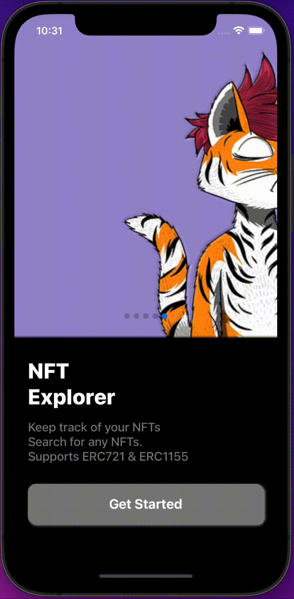

# NFTsearch

**NFTsearch** is an iOS/Android cross-platform mobile app for workouts to keep in track of what you achieved day to day. Otivation is built with React Native and Node.js.

#### Technology used

---

- [JavaScript](https://www.javascript.com/)
- [React Native](https://reactnative.dev/)
- [NodeJS](https://nodejs.org/en/)
- [Realm](https://www.mongodb.com/realm/lp?utm_source=google&utm_campaign=gs_footprint_row_search_brand_realm_atlas_product_desktop&utm_term=realm&utm_medium=cpc_paid_search&utm_ad=p&utm_ad_campaign_id=11303420057&adgroup=118482427679&gclid=CjwKCAjwopWSBhB6EiwAjxmqDUx0Rr1_OxjGiYuTtUVYCn6-GbFGLTdYeKUD5Oz6WSfpd9_SOoGwYBoC838QAvD_BwE)

## Features

       

### Authentication  

- Register / Login with email and password
- Login with Firebase Google Authentication
         

       

### CRUD exercises  

- Get, add, delete, update exercises to/from PostgreSQL database
- Fetch data realtime using useFocusEffect
         

       

### Personal Profile  

- Upload profile image
- Get, add, delete, update unique profiles to/from PostgreSQL database
